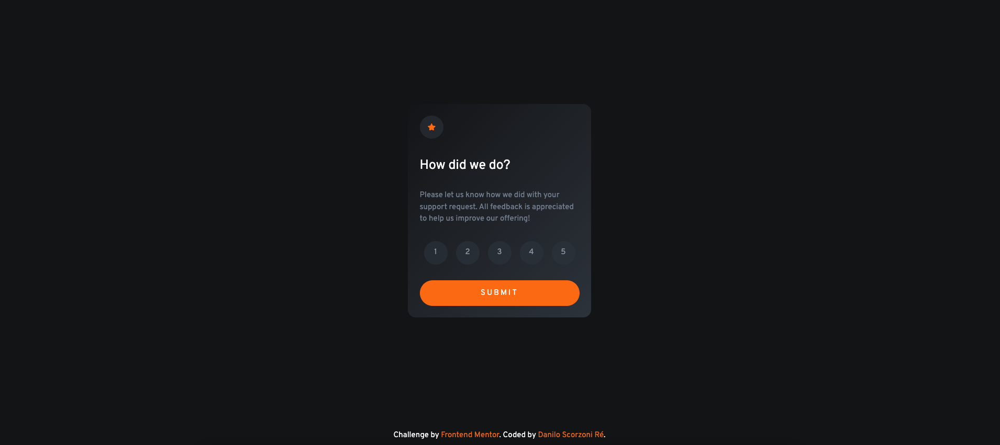

# Frontend Mentor - Interactive rating component solution

This is a solution to the [Interactive rating component challenge on Frontend Mentor](https://www.frontendmentor.io/challenges/interactive-rating-component-koxpeBUmI). Frontend Mentor challenges help you improve your coding skills by building realistic projects.

## Table of contents

- [Overview](#overview)
  - [The challenge](#the-challenge)
  - [Screenshot](#screenshot)
  - [Links](#links)
- [My process](#my-process)
  - [Built with](#built-with)
  - [What I learned](#what-i-learned)
  - [Useful resources](#useful-resources)
- [Author](#author)

## Overview

### The challenge

Users should be able to:

- View the optimal layout for the app depending on their device's screen size
- See hover states for all interactive elements on the page
- Select and submit a number rating
- See the "Thank you" card state after submitting a rating

### Screenshot

### Desktop:



### Mobile:


### Links

- Solution URL: [Github Code](https://github.com/dscorzoni/project-rating-component)
- Live Site URL: [Github Pages](https://dscorzoni.github.io/project-rating-component/)

## My process

### Built with

- Semantic HTML5 markup
- Flexbox
- Vanilla Javascript

### What I learned

I believe the most difficult part of this challenge was understanding how to merge the radio button components without showing them in the screen. The solution that I've found (it's mentioned in the useful resources) was creating a `<div>` to use together with `<label>`.

```html
<label for="1">
  <input type="radio" name="rating" id="1" value="1" />
  <div class="box">1</div>
</label>
```

And when styling, I had to do it together:

```css
.box {
    background-color: hsla(212, 16%, 23%, 0.608);
    color: var(--lightgrey);
    width: 3rem;
    height: 3rem;
    display: flex;
    justify-content: center;
    align-items: center;
    border-radius: 50%;
    line-height: 12px;
    cursor: pointer;
    position: relative;
    transition: all 0.4s;
}

input[type="radio"] {
    display: none;    
}

input[type="radio"]:checked + .box {
    background-color: var(--lightgrey);
    color: var(--white);
}

input[type="radio"]:hover + .box {
    background-color: var(--primary);
    color: var(--white);
}

input[type="radio"]:focus + .box {
    background-color: var(--primary);
    color: var(--white);
}

input[type="radio"]:active + .box {
    background-color: var(--primary);
    color: var(--white);
}
```

The remaining part was more straight-forward, including the Javascript.

### Useful resources

- [Styling radio buttons](https://www.sliderrevolution.com/resources/styling-radio-buttons/) - This link has a big list of radio buttons styling options.

## Author

- Website - [Danilo Scorzoni Ré](https://www.github.com/dscorzoni)
- Frontend Mentor - [@dscorzoni](https://www.frontendmentor.io/profile/dscorzoni)
- LinkedIn - [@dscorzoni](https://www.linkedin.com/in/dscorzoni/)
